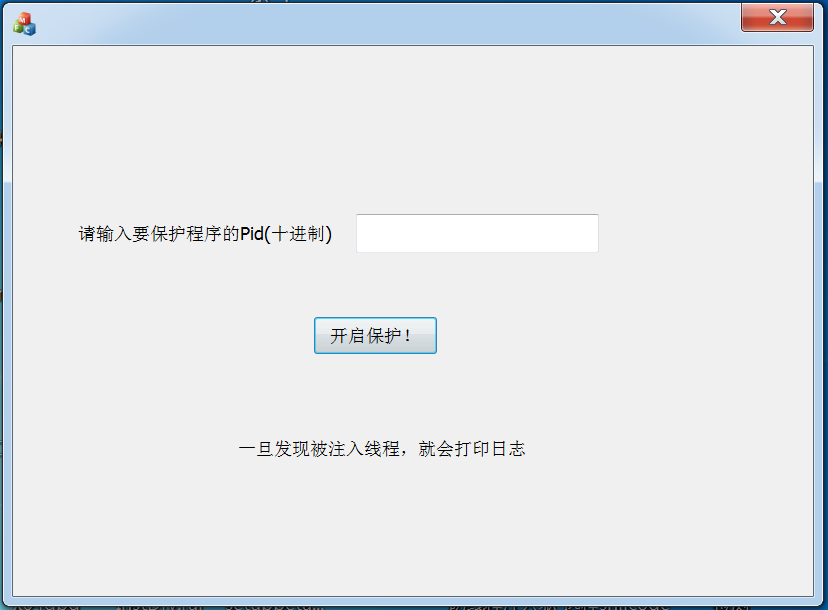
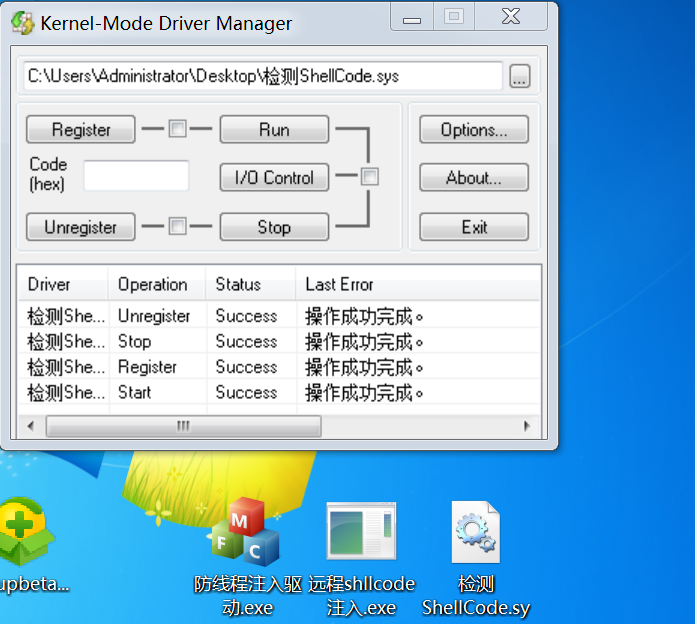
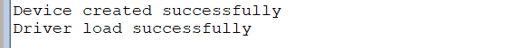
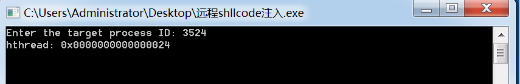
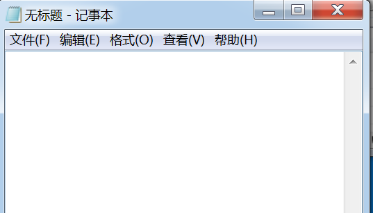
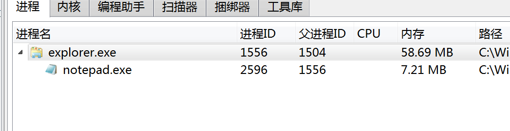
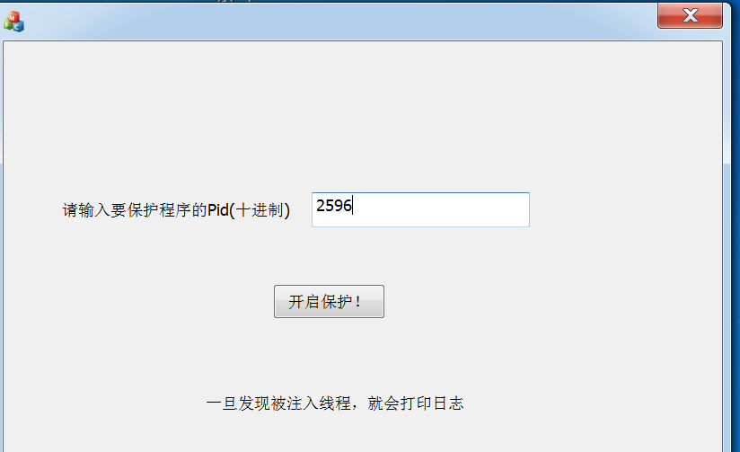
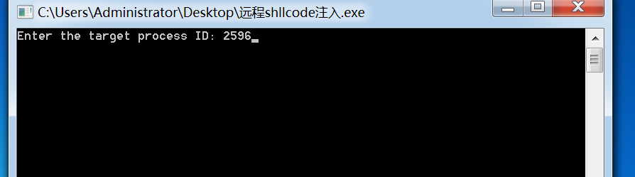
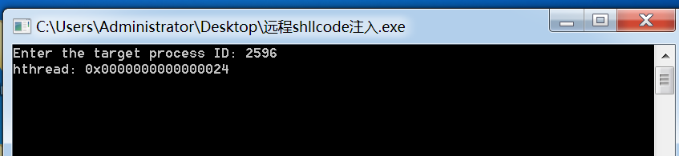
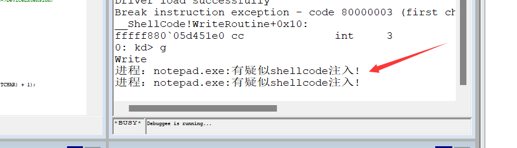

# 驱动检测Shellcode注入项目

本项目在Win7 x64完美运行，如果发现运行不了，可能是偏移问题，自行在源码上更改即可。

## 项目作用

主要监测是否有疑似Shellcode注入后，启动CreateThread或者远程CreateRemoteThread执行注入的Shellcode代码

## 原理：

注入Shellcode后，一般需要起线程去执行这个Shellcode，那么这时候我们通过设置一个创建线程回调函数`PsSetCreateThreadNotifyRoutine`，在线程开启，执行之前抢先收到消息

在线程创建例程里面，我们通过参数Pid可以知道是否是我们需要监控的进程，一旦确定，就Attach上该进程去遍历它的Vad树。

我们知道，VirtualAlloc出来的地址是Private属性，并且是要具有Excute（可执行属性的），因此我们去从Vad树遍历到区段，然后就可以进行判断疑似Shellcode的执行

比如本项目就是如果发现有疑似Shellcode注入，就会打印日志

## 使用讲解：

从Github上下载我们滴项目三件套

两个Exe和一个驱动

其中防线程注入驱动.exe长这样：

需要我们手动输入要保护的进程的Pid，暂时只支持保护一个进程

然后是检测ShellCode.sys，用驱动加载器加载上之后

可以收到日志信息

最后这个远程shellcode注入.exe是一个注入shellcode并远程起线程的小工具

输入Pid之后就会注入shellcode，并且执行

## 效果展示：

首先打开一个记事本

然后用Openark去查看这个记事本的Pid，发现是2596

将要保护的进程的Pid输入，点击开始保护

打开shellcode注入软件，输入以后，按回车

打开日志看，立刻就有警报

